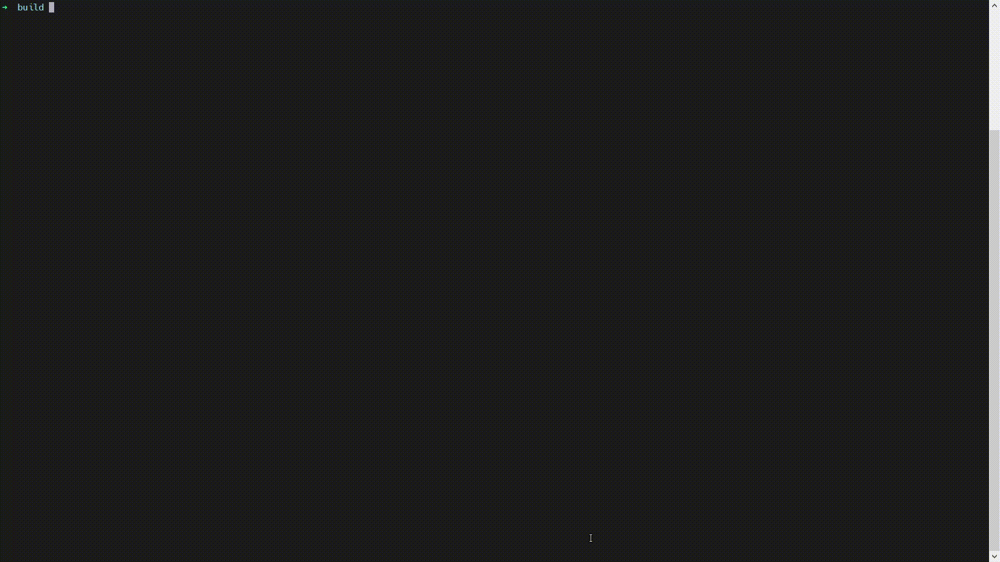

# AStar

该项目使用[C++工程模板](https://github.com/filipdutescu/modern-cpp-template.git)来完成。

## 使用步骤

1. 执行以下命令，克隆本项目到本地：  
   `git clone git@github.com:YouZhiZheng/AStar.git`
2. 在 **`Astar/`** 下依次执行下面的命令：  
   ```bash
    mkdir build/ && cd build/
    cmake ..
    cmake --build .
   ```
3. 执行以下命令，运行程序：  
   `./bin/Debug/Astar`

## 效果

